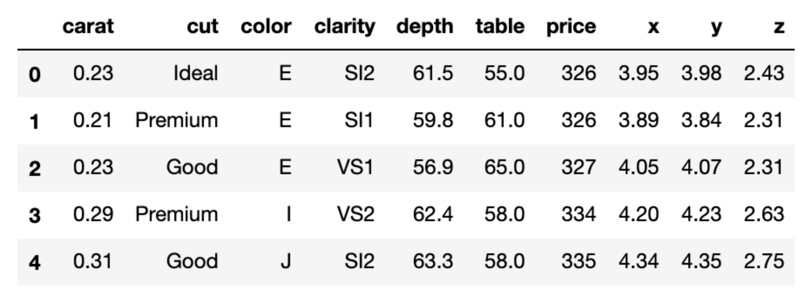

# Diamond-Appraiser

Predicting value of loose diamonds based on specific characteristics

## Project Motivation

Being able to identify the value of particular diamonds is a craft many dedicate themselves to mastering. With the goal of automating achieving a similar outcome within reasonable accuracy, we set out to train various machine learning models on diamond characteristics.

## The Question: 

How do different features of the diamonds in our data influence the price?

Here are visualizations of the distribution of diamond prices for the categorical features:

Below are scatterplots depicting the relationships between the continous variables.

Finally, here is a snippet of the DataFrame:

## The Models

After trying Linear Regression, Random Forest models, and various boosted methods, we found that a 7-layer deep neural network worked best, using Root Mean Squared Error to minimize loss. 

Finally, we ended up using an ensemble of the six best deep neural network models that we achieved, stacked, used as an input layer to another neural net.

# Conclusion

Using the Stacked Neural Network, we were able to obtain a highly accurate model, with a 4.4% margin of error.

# Contact

If you have any thoughts, questions, or additions to the project, please feel free to reach out to us. 

We'd like to thank you for checking out our project!

